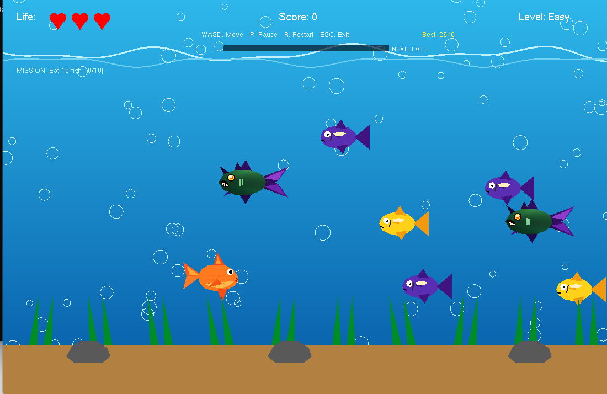

🐟 Ocean-Hunter-2D

  <strong>A 2D Underwater Fish-Eating Survival Game</strong> 
  Built with <strong>C++, OpenGL & GLUT</strong>

  
  
  
  

🎮 Game Preview

  

  <em>Ocean-Hunter-2D gameplay preview</em>

📖 About the Game

Ocean-Hunter-2D is a 2D underwater survival game developed as a Computer Graphics project using C++, OpenGL, and GLUT.

The player controls a fish, collects colorful food fish to increase the score, avoids dangerous monster fish, and progresses through increasingly challenging levels.

The game combines real-time movement, collision detection, animated underwater graphics, enemy behavior, power-ups, missions, achievements, combo scoring, and game statistics into a complete mini-game experience.

✨ Features

🐟 Player-controlled fish

🍬 Colorful food fish

👾 Monster enemy fish

🧠 Enemy AI in the final Hard level only

❤️ Three-life system

⭐ Score and best-score system

🏆 Persistent high score

🔥 Combo scoring

🪙 Coin power-up

🛡️ Shield power-up

⚡ Speed boost power-up

❤️ Extra-life power-up

✨ Particle effects

💥 Collision effects

🎯 Mission system

🏅 Achievement system

📊 Level progress bar

⏱️ Survival-time statistics

📈 Detailed game-over statistics

⏸️ Pause / Resume

🔄 Restart

🖱️ Interactive main menu

⏱️ 3-2-1 countdown

🌊 Animated underwater environment

🫧 Animated bubbles

🌿 Underwater grass and scenery

🎮 WASD controls

🕹️ Controls

Key

Action

W

Move Up

A

Move Left

S

Move Down

D

Move Right

P

Pause / Resume

R

Restart

ESC

Exit

Mouse input is also supported for interacting with the main menu.

🎯 Game Progression

The game contains three difficulty levels.

🟢 Easy

Normal enemy movement

Lower enemy speed

Beginner-friendly gameplay

No enemy AI

🟡 Medium

Increased enemy speed

Faster gameplay

More challenging survival

No enemy AI

🔴 Hard

Highest difficulty

Faster enemies

Enemy AI becomes active

Monster fish gradually chase the player's vertical position

⚡ Power-Ups

Power-Up

Effect

🪙 Coin

+50 score

🛡️ Shield

Temporary protection

⚡ Speed

Temporary movement boost

❤️ Heart

Restores one life

🔥 Combo System

Eating food fish consecutively within the combo time window increases the combo multiplier.

Example:

+10
+10
+15

🔥 COMBO x3

Higher combos provide additional bonus score.

🎯 Mission System

The game includes objectives that reward the player for completing specific goals.

Example:

MISSION: Eat 10 fish
Progress: 7 / 10

Completing a mission awards bonus points and displays a completion notification.

🏅 Achievement System

The game tracks several achievements:

Achievement

Requirement

🐟 First Catch

Eat your first fish

🔥 Combo Master

Reach a high combo

⭐ Score 200

Reach 200 points

🏆 Score 500

Reach 500 points

⏱️ Survivor

Survive for 60 seconds

⚡ Power Hunter

Collect multiple power-ups

🧠 Graphics & Game Concepts

This project demonstrates important Computer Graphics and game-development concepts, including:

2D object rendering

Geometric primitives

Translation and scaling

Object animation

Real-time keyboard input

Mouse interaction

Collision detection

Particle effects

HUD design

Game-state management

Difficulty progression

Basic enemy AI

Randomized object spawning

Timer-based game updates

🛠️ Technologies Used

C++

OpenGL

GLUT

Code::Blocks

Windows API for keyboard-state polling

📁 Project Structure

Ocean-Hunter-2D/
│
├── main.cpp
├── FinalProject.cbp
├── Group3.pdf
├── README.md
│
├── docs/
│   └── gameplay.png
│
├── bin/
└── obj/

bin/ and obj/ are build-generated directories and are normally not required in the source repository.

🚀 How to Run

1. Clone the Repository

git clone https://github.com/Tashin90/Ocean-Hunter-2D.git
cd Ocean-Hunter-2D

2. Open the Project

Open:

FinalProject.cbp

using Code::Blocks.

3. Build and Run

In Code::Blocks:

Build → Rebuild
Build → Run

Make sure the required OpenGL and GLUT libraries are correctly configured in Code::Blocks.

📸 Screenshots

Gameplay

  

📄 Project Report

The complete project report is available here:

📄 Group3.pdf

👥 Project Information

Project Name: Ocean-Hunter-2D
Project Type: Computer Graphics Project
Language: C++
Graphics API: OpenGL
Library: GLUT
IDE: Code::Blocks
Platform: Windows

🔮 Future Improvements

Possible future enhancements include:

🎵 Background music and sound effects

👑 Boss battles

🌊 Multiple underwater environments

🐙 More enemy types

🌟 Additional power-ups

🥇 Online leaderboard

⚙️ Advanced settings

🎨 Improved graphical assets

  Made with ❤️ using <strong>C++, OpenGL & GLUT</strong>

